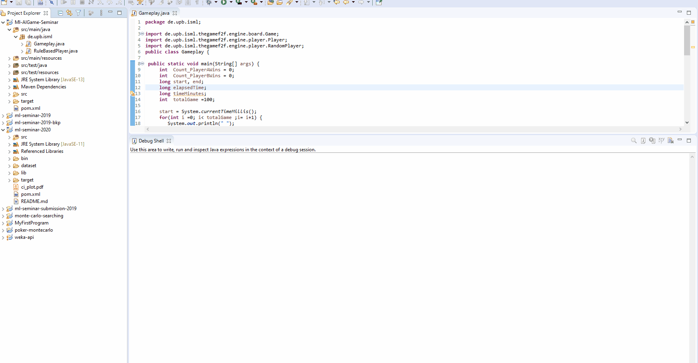
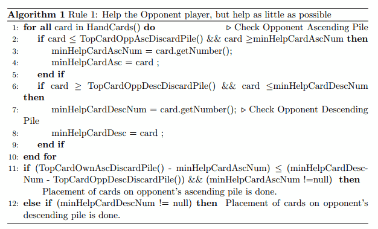
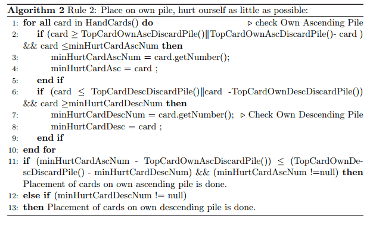

# Project Title

# AI for the game “The Game: Face to Face”.
This repository contains source code for the rule-based AI player for "The Game: Face to Face". It is a game played between two players, The present report discusses the rule-based AI player for "The Game: Face to Face", which is a game played between two players, each player has either a 60 silver cards or 60 gold cards of the same shading with numbers 1 to 60 on them.(total 120 cards ).
Each player lay down the row cards( 1-59 and 60-2) in front of them in table. 
Over the span of the game the number cards are laid to the right of these cards.

Thorougly, both player shuffle their 58 cards and then each player  picks up the first 6 cards from their own respective pile, which make up his hand cards.
The game is played in turns and the rule is that you have to discard at least two or more cards from your hand(descending or ascending pile of your own or opponent's based on the game rules) and then pick up cards from your own draw pile to end your turn.
In this way, the game is played until one player has no more cards in their hand.
This player will be the winner.
## Getting Started

To get started with the game “The Game: Face to Face”.
- [Prerequisite]()
- [Installation]()
- [Running the Game]()
- [Code & Concept]() 

### Prerequisite


* Install [Git](https://git-scm.com/downloads)
* Install [Java version 12 or later](https://www.oracle.com/java/technologies/javase/jdk12-archive-downloads.html)
* Install an IDE, recommended [eclipse](https://www.eclipse.org/downloads/)
* OS (windows or Linux with 8 GB RAM and 4 cores available)


### Installing

* Clone the repository to your local machine with ```git clone --single-branch --branch dev https://git.cs.upb.de/avishekm/seminar-machine-learning.git```
* Navigate to seminar-machine-learning folder (cd seminar-machine-learning) and run ``` mvn clean compile ```
* After the project is build successfully, you can continue to run the game. 

### Running the Game
 * To run in an IDE, load the project in the IDE and run ``` Gameplay.java ``` file.<br>
 * ``` Gameplay.java ``` file consist of following code snippet shows:
 ```
1.  int  totalGame =100;
2.  for(int i =0; i< totalGame ;i= i+1) 
3.     {
4.	    Player playerA = new RuleBasedPlayer("A");
5.	    Player playerB = new RandomPlayer("B");
6.	    Game game = new Game(playerA, playerB, i);
7.	    Player winner = game.simulate();
8.	    Count_PlayerAWins += winner == playerA ? 1 : 0;
9.	    Count_PlayerBWins += winner == playerB ? 1 : 0;
10.	    game.getHistory().printHistory();
11.	}
12.	end = System.currentTimeMillis();
13.	elapsedTime = end- start;
14.	timeMinutes = elapsedTime/60000;
15.	System.out.println(" "); 
16.	System.out.println("Percentage of Winning for Player A out of "+totalGame+" Moves is [" +((double) Count_PlayerAWins/totalGame)*100+"]");
17.	System.out.println("Player A wins " + Count_PlayerAWins + " times, Player B wins " + Count_PlayerBWins + " times.");
18.	System.out.println("Total time taken in millseconds "+elapsedTime);
	
 ```
- The line no 1 show no of game to be played.
- The Line no 4-6 initializes our Rule based AI Player, Random Player and Game between rule based player and random player.
- The line no 7 return winner player of game.
- The line no 8-9 maintain a counter for Player A or B wins.
- The line 10 show game history.
- The line 16-18 shows winner player percentage, no of times it wins and time it tooks in milliseconds.
 * Below shows a simulation of the Game played between AI player and Random Player
 ```
   No of Games = 100
 ```
 ``` 
   Percentage of Winning for Player A out of 100 Moves is [68.0 %]
 ```
 ```
   Player A(AI) wins 68 times, Player B(Random) wins 32 times.
 ```  
 ```
   Total time it tooks to finish the game is 2769 millseconds
 ```
   
### Concept & Code 
The concept behind the entire game is to demonstrate how our rule-based AI player could play against opponent(Random Player).<br>
The Rule-based AI Player is composed of two main rules :<br>
- Rule 1:  Help the Opponent player, but help as little as possible.
- Rule 2:  Place cards on our own pile, hurt ourself as little as possible <br> 

The explaination of Rule 1 with code snippet is shown below:<br>

The Algorithm for the Rule 1 is describe below, here AI player is placing atleast one card  in  each  round.   For  placement  of  cards  on  ascending  pile  of  opponent’s  we  see AI  player  checks  whether  its  current  hand  cards  is  less  than  Top  Card  of  OpponentsAscending Discard Pile and it should be greater than the minimum Helping AscendingCard ( i.e initially minimum Helping Ascending Card is assigned with -1 value).  Here,our goal is look for minimum or least helping card to place on ascending pile.Similarly, we can see for placement of card on descending pile of opponent’s we check reverse  condition  that  is  current  hand  card  should  be  greater  than  Top  Card  of  Op-ponents Descending Discard Pile and less than minimum helping descending card( i.e initially minimum Helping descending Card variable is assigned with 61 value) here our objective is looking for higher no card to be placed. In this way by checking all game rules final placements of cards on opponent’s ascending and descending pile is done.

 <br>


The Algorithm for Rule 2 is show below in code snippet:
The Algorithm for the Rule 2 is describe below,  here AI player is placing cards on ascending discard pile of its own. For placement of cards on ascending pile of its own’s, AI player checks whether its current hand cards is greater than Top Card of Own Ascending Discard Pile and we are also checking for the exception rule of game for own ascending pile (placing a card that is exactly 10 less than the number showing on the pile in a Or condition) and current card should lesser than the minimum Hurting Ascending Card( initially minimum Hurting Ascending Card is assigned with value 61, because we arelooking for smaller card ).  Here, our goal is to look for minimum or least hurting cardto our self to place on ascending pile.Similarly, we can see for placement of card on own descending pile .we check current hand  card  should  be  less  than  Top  Card  of  Own  Descending  Discard  Pile,  Or  condi-tion we checked the difference between current cards and Top Card of Own DescendingDiscard Pile should have a difference of 10 and current card should be grater than min-imum hurting descending card( i.e initially minimum hurting descending Card variableis assigned with -1 value) here our objective is looking for a card with less hurting to be placement in descending pile. In this way by checking all game rules final placements of cards on own ascending and descending pile is done.<br>

### Project report [here](https://github.com/avishek2020/Machine-Learning-AI-Agent/blob/master/Report/Report_Ml_AI_Game_Seminar.pdf) 
## Built With
* [Java](https://www.oracle.com/java/technologies/javase-downloads.html) - Java SE 12/13
* [Maven](https://maven.apache.org/) - Dependency Management


